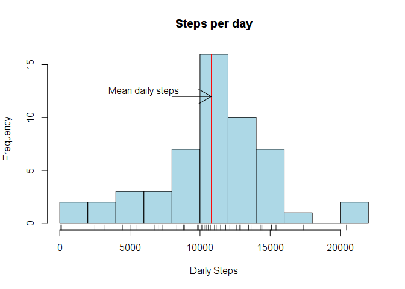
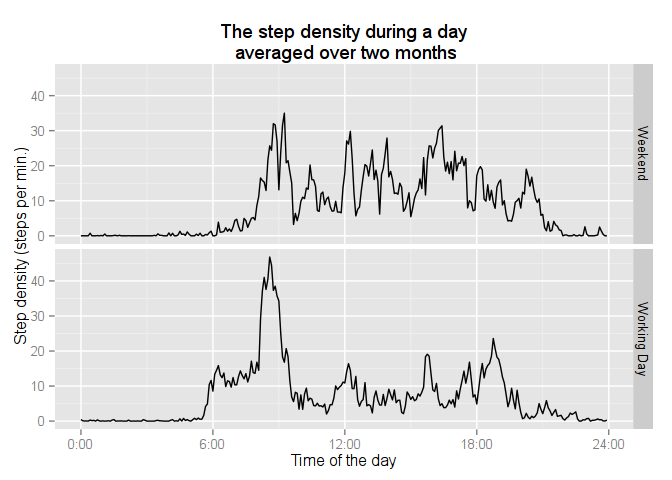
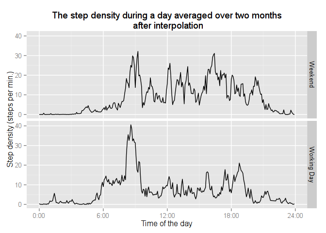

# Reproducible Research: Peer Assessment 1


## Loading and preprocessing the data

We will make use of the data.table and ggplot2 packages. Installable from CRAN.

The date entry will be a factor but that is fine.

```r
options(scipen = 1) # to beautify he mean and median output
library("data.table")
```

```
## 
## Attaching package: 'data.table'
## 
## The following object is masked _by_ '.GlobalEnv':
## 
##     .N
```

```r
library("ggplot2")
if (!file.exists("activity.csv")) unzip(file = "activity.zip")
rawdat <- data.table(read.csv("activity.csv")) 
tomin <- function(x) 60 * (x %/% 100) + x %% 100
rawdat[, minutes := tomin(interval)]
```

```
##        steps       date interval minutes
##     1:    NA 2012-10-01        0       0
##     2:    NA 2012-10-01        5       5
##     3:    NA 2012-10-01       10      10
##     4:    NA 2012-10-01       15      15
##     5:    NA 2012-10-01       20      20
##    ---                                  
## 17564:    NA 2012-11-30     2335    1415
## 17565:    NA 2012-11-30     2340    1420
## 17566:    NA 2012-11-30     2345    1425
## 17567:    NA 2012-11-30     2350    1430
## 17568:    NA 2012-11-30     2355    1435
```
## What is the mean total number of steps taken per day?

We first check for missing data: absolute and percentage


```r
sum(rawdat[,is.na(steps)])
```

```
## [1] 2304
```

That is about 13%  of the dataset. 


```r
weekday <- function(x) weekdays(as.Date(as.character(x)))
rawdat[,.(missing = sum(is.na(steps))), by=weekday(date)]
```

```
##      weekday missing
## 1:    Monday     576
## 2:   Tuesday       0
## 3: Wednesday     288
## 4:  Thursday     288
## 5:    Friday     576
## 6:  Saturday     288
## 7:    Sunday     288
```

Except for Tuesday all days are affected in an oddly regular way

We should first understand the behavior of the step density over time.

We first calculate the average daily steps, skipping the missing data for now.


```r
setkey(rawdat, date) # speeds up selection
stepsperday <- rawdat[complete.cases(rawdat), .(dsteps = sum(steps)), by = key(rawdat)]
mean(stepsperday$dsteps) # the bare value
```

```
## [1] 10766.19
```

```r
median(stepsperday$dsteps)
```

```
## [1] 10765
```

```r
dmean <- round(mean(stepsperday$dsteps), -2) # appropriately rounded off
dmedian <- round(median(stepsperday$dsteps), -2)
stderr <- sd(stepsperday$dsteps) / sqrt(length(stepsperday))
```

With the values rounded off in accordance wth an estimated error of 'r stderr' steps.

We find a daily average of 10800 steps a day, which corresponds to $\sim 8$ km ($\sim 5$ miles) for an average person. 

This happens to be accidentally (?) the "official" healthy target. 

The median of 10800, being close to the mean, hints at a symmetric distribution. 

We can check this with a histogram:


```r
h <- hist(stepsperday[, dsteps], breaks = 10, xlab = 'Daily Steps',
                            main = 'Steps per day',col='lightblue')
rug(stepsperday[, dsteps])
lines(c(dmean, dmean), c(0, max(h$counts)), col = "red")
arrows(8000, 3*max(h$counts) / 4, dmean, 3 * max(h$counts) / 4)
text(6000, 3*max(h$counts) / 4 + 0.5, "Mean daily steps")
```



The histogram reveals the distribution is far from symmetric, although there are two outliers that have a dazzling number of steps close to *zero*!

The pedometer was hardly in use those days.

## What is the average daily activity pattern?

To be able to correct for the missing data we first check the average step density over the day, since it seems likely to vary substantially.

We will use the ggplot2 package. 


```r
library("ggplot2")
g <- ggplot(subset(rawdat,!is.na(steps)), aes(minutes, steps))
g <- g + stat_summary(fun.y = mean, geom = "line", colour = "blue") 
g <- g + ggtitle("The aveage step density during a day")
g <- g + ylab("Step density (steps per min.)") + xlab("Time of the day")
labtime <- function(x) {sprintf('%d:%02d', x %/% 60, x %% 60)}
labdensity <- function(x) sprintf('%d', x/5)
g <- g + scale_x_continuous(breaks = seq(0, 1440, 360), labels = labtime) 
g + scale_y_continuous(labels = labdensity)
```


As was to be expected the bearer did sleep during the night. There is an interesting peak in the morning 


```r
setkey(rawdat, minutes)
meanstep <- rawdat[complete.cases(rawdat), .(mnstep = mean(steps)), by = key(rawdat)]
labtime(meanstep[mnstep == max(meanstep[,mnstep]), minutes])
```

```
## [1] "8:35"
```

At 8:35. Perhaps we observe here a regular jogging time. Before we can model the data in order to 

fill in the missing data we need some more information, There is perhaps a difference between weekdays and weekends.

## Are there differences in activity patterns between weekdays and weekends?

To differentiate between working days and weekends we add a column to the data.table.


```r
isweekend <- function(x){day<-weekdays(as.Date(as.character(x)))
             ifelse ((day == 'Saturday' | day == 'Sunday'), 'Weekend', 'Working Day')}
rawdat[, day := isweekend(date)]
```

```
##        steps       date interval minutes         day
##     1:    NA 2012-10-01        0       0 Working Day
##     2:     0 2012-10-02        0       0 Working Day
##     3:     0 2012-10-03        0       0 Working Day
##     4:    47 2012-10-04        0       0 Working Day
##     5:     0 2012-10-05        0       0 Working Day
##    ---                                              
## 17564:     0 2012-11-26     2355    1435 Working Day
## 17565:     0 2012-11-27     2355    1435 Working Day
## 17566:     0 2012-11-28     2355    1435 Working Day
## 17567:     0 2012-11-29     2355    1435 Working Day
## 17568:    NA 2012-11-30     2355    1435 Working Day
```

Next we plot the data using the ggplot package


```r
g <- ggplot(subset(rawdat, !is.na(steps)), aes(minutes, steps))
g <- g + stat_summary(fun.y = mean, geom = "line") 
g <- g + ggtitle("The step density during a day\n averaged over two months")
g <- g + facet_grid(day ~ .)
g <- g + ylab("Step density (steps per min.)") + xlab("Time of the day")
g <- g + scale_x_continuous(breaks = seq(0, 1440, 360), labels = labtime) 
g + scale_y_continuous(labels = labdensity)
```




There is a clear difference in the morning, where the step density starts to grow a couple of hours 

later during the weekend. It is compensated though by a higher activity in the afternoon. 

It is, due to the limited sample size not possible to differentiate any further between days, but we can 

extrapolate the observations to fill in the missing data.

## Inputing missing values

We use the average over the two month period for each 5 minute density, thereby differentiating between 

working days and weekends. We first calculate the means for both cases and then inplace add the missing values


```r
setkey(rawdat, interval) # to speed up
weekmean<- subset(rawdat, !is.na(steps) & day != 'Weekend')[,  #first subsetting
          .(mnsteps = as.integer(mean(steps))), by = key(rawdat)] #then create column
wkndmean<- subset(rawdat,!is.na(steps) & day == 'Weekend')[,
          .(mnsteps = as.integer(mean(steps))), by = key(rawdat)]
```

Now we can set the missing values in place:


```r
rawdat[(is.na(steps) & day == 'Weekend'), steps := wkndmean[interval == interval, mnsteps]]
```

```
##        steps       date interval minutes         day
##     1:    NA 2012-10-01        0       0 Working Day
##     2:     0 2012-10-02        0       0 Working Day
##     3:     0 2012-10-03        0       0 Working Day
##     4:    47 2012-10-04        0       0 Working Day
##     5:     0 2012-10-05        0       0 Working Day
##    ---                                              
## 17564:     0 2012-11-26     2355    1435 Working Day
## 17565:     0 2012-11-27     2355    1435 Working Day
## 17566:     0 2012-11-28     2355    1435 Working Day
## 17567:     0 2012-11-29     2355    1435 Working Day
## 17568:    NA 2012-11-30     2355    1435 Working Day
```

```r
rawdat[(is.na(steps) & day != 'Weekend'), steps := weekmean[interval == interval, mnsteps]]
```

```
##        steps       date interval minutes         day
##     1:     2 2012-10-01        0       0 Working Day
##     2:     0 2012-10-02        0       0 Working Day
##     3:     0 2012-10-03        0       0 Working Day
##     4:    47 2012-10-04        0       0 Working Day
##     5:     0 2012-10-05        0       0 Working Day
##    ---                                              
## 17564:     0 2012-11-26     2355    1435 Working Day
## 17565:     0 2012-11-27     2355    1435 Working Day
## 17566:     0 2012-11-28     2355    1435 Working Day
## 17567:     0 2012-11-29     2355    1435 Working Day
## 17568:     1 2012-11-30     2355    1435 Working Day
```

a little check


```r
sum(rawdat[,is.na(steps)])
```

```
## [1] 0
```

That looks good


```r
setkey(rawdat, date) # speeds up selection
stepsperday <- rawdat[, .(dsteps = sum(steps)), by = key(rawdat)]
mean(stepsperday$dsteps)
```

```
## [1] 10746.59
```

```r
median(stepsperday$dsteps)
```

```
## [1] 10600
```

The mean has more or less stayed the same, but the median has decreased from its value without missing value insertion.

The reason is that most of the missing values were during the night where the activity is low. Using a mean 

approximation for the missing values affects especially the median, this could be improved upon using 

bootstrapping. 

Finally we can inspect the daily density curves after filling in the missing data:


```r
g <- ggplot(rawdat, aes(minutes, steps))
g <- g + stat_summary(fun.y = mean, geom = "line") 
g <- g + ggtitle("The step density during a day averaged over two months\n after interpolation")
g <- g + facet_grid(day ~ .)
g <- g + ylab("Step density (steps per min.)") + xlab("Time of the day")
g <- g + scale_x_continuous(breaks = seq(0, 1440, 360), labels = labtime) 
g + scale_y_continuous(labels = labdensity)
```




